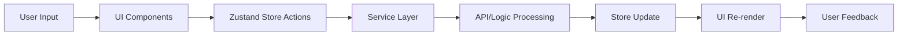
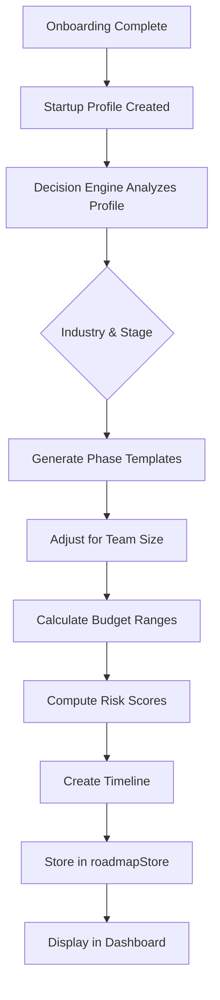

<div align="center">

# 🚀 FounderPath

**Your Personalized Startup Roadmap Generator**

[](https://reactnative.dev/)
[](https://expo.dev/)
[](https://www.typescriptlang.org/)
[](https://zustand-demo.pmnd.rs/)

*Navigate your entrepreneurial journey with confidence*

[Features](#-features) • [Architecture](#-architecture) • [Getting Started](#-getting-started) • [Screenshots](#-screenshots) • [Contributing](#-contributing)

</div>

---

## 📖 Table of Contents

- [Overview](#-overview)
- [Features](#-features)
- [Architecture](#-architecture)
- [Tech Stack](#-tech-stack)
- [Getting Started](#-getting-started)
- [Project Structure](#-project-structure)
- [Key Components](#-key-components)
- [State Management](#-state-management)
- [Roadmap Generation Logic](#-roadmap-generation-logic)
- [Theming System](#-theming-system)
- [Future Enhancements](#-future-enhancements)
- [Contributing](#-contributing)
- [License](#-license)

---

## 🌟 Overview

**FounderPath** is a comprehensive mobile application designed to guide startup founders through every stage of their entrepreneurial journey. From initial idea validation to market expansion, FounderPath provides:

✨ **Personalized Roadmaps** - Dynamic task lists tailored to your startup profile  
🤖 **AI-Powered Advisor** - Chat with FounderAI for strategic guidance  
📊 **Risk Assessment** - Real-time analysis of market, technical, and financial risks  
💰 **Multi-Currency Support** - Budget planning in INR, USD, EUR, or GBP  
🌓 **Beautiful UI** - Smooth animations with light/dark mode support  

Whether you're a first-time founder or scaling your third venture, FounderPath adapts to your experience level, team size, and industry.

---

## ✨ Features

### 🗺️ **Dynamic Roadmap Generation**
- **Adaptive Phases**: Validation → Legal & Structure → MVP Development → Launch → Growth
- **Smart Task Allocation**: Generates tasks based on your startup profile (industry, stage, funding, team size)
- **Progress Tracking**: Visual progress bars and completion percentages for each phase
- **Timeline Optimization**: Dynamically adjusts future phase timelines based on actual completion speed

### 🤖 **AI Chat Assistant (FounderAI)**
- Context-aware conversational AI that understands your startup profile
- Provides guidance on roadmap tasks, budgeting, strategy, and risk mitigation
- Uses your current progress and risk scores to give personalized advice

### 📊 **Risk Analysis Dashboard**
- **Market Risk**: Evaluates market saturation and competitive landscape
- **Technical Risk**: Assesses team capabilities vs. technical complexity
- **Financial Risk**: Analyzes runway and burn rate
- Real-time risk gauges with color-coded indicators (Low/Medium/High)

### 💼 **Startup Profile Customization**
- **Industry Selection**: SaaS, E-commerce, FinTech, HealthTech, EdTech, and more
- **Stage-Based Guidance**: Idea, Validation, MVP, Launch, Growth, Scaling
- **Team Size Tracking**: Adjusts recommendations based on team capacity
- **Funding Status**: Bootstrapped, Pre-Seed, Seed, Series A+

### 🌍 **Market Expansion Planning**
- Toggle expansion mode for growth strategies
- Choose between same market penetration or new market entry
- Expansion readiness checklist
- Risk assessment for expansion scenarios

### 🎨 **Premium UI/UX**
- **Smooth Animations**: Fade-in, slide, and scale animations throughout
- **Dark/Light Modes**: Beautiful color palettes for both themes
- **Responsive Design**: Works seamlessly on iOS, Android, and Web
- **Custom Components**: Reusable Card, Button, Input, and ProgressBar components

### 💰 **Multi-Currency Support**
- Real-time currency conversion (INR, USD, EUR, GBP)
- Budget estimates for every task with low/high ranges
- Formatted currency display with K/M abbreviations

---

## 🏗️ Architecture

```
┌─────────────────────────────────────────────────────────┐
│                     User Interface                       │
│  ┌──────────┐  ┌──────────┐  ┌──────────┐  ┌─────────┐ │
│  │  Auth    │  │Dashboard │  │ Roadmap  │  │  Chat   │ │
│  │ Screens  │  │  Screen  │  │  Screen  │  │ Screen  │ │
│  └────┬─────┘  └────┬─────┘  └────┬─────┘  └────┬────┘ │
└───────┼─────────────┼─────────────┼──────────────┼──────┘
        │             │             │              │
        └────────���────┴─────────────┴──────────────┘
                          │
        ┌─────────────────┴─────────────────┐
        │      Zustand State Management     │
        │  ┌──────────┐  ┌───────────────┐  │
        │  │ authStore│  │ roadmapStore  │  │
        │  ├──────────┤  ├───────────────┤  │
        │  │ chatStore│  │ currencyStore │  │
        │  ├──────────┤  ├───────────────┤  │
        │  │themeStore│  │onboardingStore│  │
        │  └──────────┘  └───────────────┘  │
        └───────────┬───────────────────────┘
                    │
        ┌───────────┴───────────────────────┐
        │         Service Layer              │
        │  ┌────────────────────────────┐   │
        │  │   Decision Engine          │   │
        │  │   (Roadmap Generation)     │   │
        │  ├────────────────────────────┤   │
        │  │   AI Chat Service          │   │
        │  │   (FounderAI Integration)  │   │
        │  ├────────────────────────────┤   │
        │  │   Auth Service             │   │
        │  │   (User Management)        │   │
        │  ├────────────────────────────┤   │
        │  │   User Data Service        │   │
        │  │   (Profile Building)       │   │
        │  └────────────────────────────┘   │
        └───────────────────────────────────┘
```

### Data Flow



### Roadmap Generation Flow



### Risk Scoring Algorithm

```
Risk Score = Weighted Average of:
├─ Market Risk (30%)
│  ├─ Market Saturation Factor
│  └─ Competitive Intensity
├─ Technical Risk (40%)
│  ├─ Team Experience Level
│  └─ Technical Complexity
└─ Financial Risk (30%)
   ├─ Funding Stage
   └─ Burn Rate vs Runway
```

---

## 🛠️ Tech Stack

| Category | Technology | Purpose |
|----------|------------|---------|
| **Framework** | React Native 0.81.5 | Cross-platform mobile development |
| **Runtime** | Expo ~54.0 | Development tooling and native APIs |
| **Language** | TypeScript 5.9.2 | Type-safe JavaScript |
| **State Management** | Zustand 5.0.11 | Lightweight state management |
| **Navigation** | React Navigation 7.x | Screen navigation and routing |
| **UI Components** | Custom + Expo Vector Icons | Consistent design system |
| **Fonts** | Inter (Google Fonts) | Modern, readable typography |
| **Animations** | React Native Animated API | Smooth, native animations |

### Key Dependencies

```json
{
  "@react-navigation/native": "^7.1.28",
  "@react-navigation/bottom-tabs": "^7.13.0",
  "@react-navigation/native-stack": "^7.12.0",
  "zustand": "^5.0.11",
  "expo-font": "~14.0.11",
  "expo-splash-screen": "~31.0.13",
  "react-native-safe-area-context": "^5.6.2"
}
```

---

## 🚀 Getting Started

### Prerequisites

- **Node.js** (v18+ recommended)
- **npm** or **yarn**
- **Expo CLI** (optional, for easier development)
- **iOS Simulator** (macOS only) or **Android Emulator**

### Installation

```bash
# Clone the repository
git clone https://github.com/aaswani-v/founderPath.git

# Navigate to project directory
cd founderPath

# Install dependencies
npm install

# Start the development server
npm start
```

### Running the App

**Using Expo Go (Recommended for Development)**
```bash
npm start
# Scan the QR code with Expo Go app (iOS/Android)
```

**iOS Simulator**
```bash
npm run ios
```

**Android Emulator**
```bash
npm run android
```

**Web Browser**
```bash
npm run web
```

### Environment Setup

> **Note**: Currently uses mock authentication. Firebase integration is planned for production.

1. **No environment variables required** for development
2. All services use mock data in `src/services/`
3. To integrate Firebase (future):
   - Create `firebase.config.ts` in `src/config/`
   - Add Firebase credentials
   - Update `authService.ts` to use Firebase SDK

---

## 📁 Project Structure

```
founderPath/
├── assets/                    # Images, icons, fonts
│   ├── icon.png
│   ├── splash-icon.png
│   └── adaptive-icon.png
├── src/
│   ├── components/            # Reusable UI components
│   │   ├── Button.tsx
│   │   ├── Card.tsx
│   │   ├── Input.tsx
│   │   ├── ProgressBar.tsx
│   │   ├── RiskGauge.tsx
│   │   ├── OptionCard.tsx
│   │   └── index.ts
│   ├── data/                  # Static data and templates
│   │   └── mockRoadmaps.ts    # Phase and task templates
│   ├── models/                # TypeScript interfaces
│   │   └── index.ts           # Startup, Roadmap, Task types
│   ├── navigation/            # Navigation configuration
│   │   ├── RootNavigator.tsx
│   │   ├── AuthStack.tsx
│   │   └── AppStack.tsx
│   ├── screens/               # Screen components
│   │   ├── auth/
│   │   │   ├── LoginScreen.tsx
│   │   │   └── RegisterScreen.tsx
│   │   ├── onboarding/
│   │   │   └── OnboardingScreen.tsx
│   │   ├── dashboard/
│   │   │   ├── DashboardScreen.tsx
│   │   │   ├── RoadmapScreen.tsx
│   │   │   ├── ChatScreen.tsx
│   │   │   └── ExpansionScreen.tsx
│   │   └── profile/
│   │       └── ProfileScreen.tsx
│   ├── services/              # Business logic
│   │   ├── authService.ts     # Authentication (mock)
│   │   ├── aiChatService.ts   # AI chat integration
│   │   ├── decisionEngine.ts  # Roadmap generation
│   │   └── userDataService.ts # Profile building
│   ├── store/                 # Zustand state stores
│   │   ├── authStore.ts
│   │   ├── roadmapStore.ts
│   │   ├── chatStore.ts
│   │   ├── currencyStore.ts
│   │   └── themeStore.ts
│   └── theme/                 # Design system
│       ├── colors.ts          # Light/Dark palettes
│       ├── spacing.ts         # Spacing, fonts, borders
│       └── themeStore.ts      # Theme management
├── App.tsx                    # Entry point
├── index.ts                   # Root component registration
├── app.json                   # Expo configuration
├── package.json               # Dependencies
└── tsconfig.json              # TypeScript configuration
```

---

## 🧩 Key Components

### 🎴 **Card Component**
```typescript
<Card title="Risk Analysis" subtitle="Current Risk Scores" variant="default">
  {/* Content */}
</Card>
```
- **Features**: Animated fade-in, customizable variants (default/dark/accent)
- **Props**: `title`, `subtitle`, `variant`, `animateIn`, `delay`

### 🔘 **Button Component**
```typescript
<Button 
  title="Generate Roadmap" 
  onPress={handlePress} 
  variant="primary" 
  loading={isLoading}
/>
```
- **Variants**: `primary`, `secondary`, `ghost`, `danger`
- **States**: Normal, pressed, loading, disabled

### 📊 **ProgressBar Component**
```typescript
<ProgressBar progress={65} color={colors.accent} />
```
- **Features**: Smooth animated fill, percentage display
- **Use Cases**: Phase completion, overall progress

### ⚠️ **RiskGauge Component**
```typescript
<RiskGauge label="Market Risk" score={72} />
```
- **Features**: Animated circular gauge, color-coded (green/yellow/red)
- **Displays**: Score, risk level (Low/Medium/High)

---

## 🧠 State Management

### Zustand Stores

**1. authStore**
```typescript
interface AuthState {
  user: UserProfile | null;
  isAuthenticated: boolean;
  login: (email, password) => Promise<void>;
  register: (email, password, name) => Promise<void>;
  logout: () => Promise<void>;
}
```

**2. roadmapStore**
```typescript
interface RoadmapState {
  roadmap: Roadmap | null;
  riskScores: RiskScore | null;
  startupProfile: StartupProfile | null;
  generateRoadmap: (profile) => void;
  updateTaskStatus: (phaseId, taskId, status) => void;
}
```

**3. chatStore**
```typescript
interface ChatState {
  messages: ChatMessage[];
  isTyping: boolean;
  sendMessage: (content: string) => Promise<void>;
  clearChat: () => void;
}
```

**4. currencyStore**
```typescript
interface CurrencyState {
  currency: 'INR' | 'USD' | 'EUR' | 'GBP';
  setCurrency: (code) => void;
  formatAmount: (usdAmount) => string;
  formatRange: (low, high) => string;
}
```

**5. themeStore**
```typescript
interface ThemeState {
  isDark: boolean;
  colors: ThemeColors;
  toggleTheme: () => void;
}
```

---

## 🎯 Roadmap Generation Logic

### Decision Engine (`decisionEngine.ts`)

The decision engine analyzes your startup profile and generates a customized roadmap:

```typescript
function generateRoadmap(profile: StartupProfile): Roadmap {
  // 1. Select relevant phases based on stage
  // 2. Filter tasks by industry and funding level
  // 3. Adjust complexity based on team size
  // 4. Calculate budget ranges using currency rates
  // 5. Estimate timelines
  // 6. Compute risk scores
  return roadmap;
}
```

### Phase Selection Logic

| Stage | Phases Included |
|-------|----------------|
| **Idea** | Validation → Legal → MVP |
| **Validation** | Legal → MVP → Launch |
| **MVP** | MVP → Launch → Growth |
| **Launch** | Launch → Growth → Scale |
| **Growth** | Growth → Scale → Expansion |

### Task Filtering Rules

- **Bootstrapped founders**: Excludes investor-related tasks
- **Technical founders**: Skips basic tech tutorials
- **First-time founders**: Includes educational resources
- **Solo founders**: Removes team management tasks

---

## 🎨 Theming System

### Color Palettes

**Light Mode**
```typescript
{
  primary: '#312C51',      // Deep purple
  accent: '#F0C38E',       // Warm gold
  background: '#F8F7FC',   // Soft lavender
  surface: '#FFFFFF',      // Pure white
  textPrimary: '#312C51',  // Dark purple
}
```

**Dark Mode**
```typescript
{
  primary: '#E8E5F0',      // Light lavender
  accent: '#F0C38E',       // Warm gold
  background: '#1A1726',   // Deep purple-black
  surface: '#231F38',      // Dark purple
  textPrimary: '#F0EDF5',  // Off-white
}
```

### Using the Theme

```typescript
import { useThemeColors } from '../theme';

const MyComponent = () => {
  const colors = useThemeColors();
  
  return (
    <View style={{ backgroundColor: colors.background }}>
      <Text style={{ color: colors.textPrimary }}>Hello</Text>
    </View>
  );
};
```

---

## 🔮 Future Enhancements

### 🔥 **Phase 1: Backend Integration**
- [ ] Firebase Authentication
- [ ] Firestore for data persistence
- [ ] Cloud Functions for AI chat
- [ ] Push notifications for task reminders

### 🤝 **Phase 2: Collaboration Features**
- [ ] Team member invitations
- [ ] Shared roadmaps
- [ ] Task assignment and comments
- [ ] Activity feed

### 📈 **Phase 3: Advanced Analytics**
- [ ] Burndown charts
- [ ] Milestone tracking
- [ ] Budget vs. actual spend
- [ ] Custom KPI dashboards

### 🌐 **Phase 4: Ecosystem Integration**
- [ ] Slack/Discord bot integration
- [ ] Notion/Trello export
- [ ] Calendar sync (Google/Outlook)
- [ ] Payment processor integration

### 🧪 **Phase 5: AI Enhancements**
- [ ] Voice input for chat
- [ ] Document analysis (pitch decks, financials)
- [ ] Competitor research automation
- [ ] Personalized growth recommendations

---

## 🤝 Contributing

We welcome contributions! Here's how you can help:

### 🐛 **Bug Reports**
1. Check existing issues first
2. Create a detailed issue with reproduction steps
3. Include screenshots if applicable

### ✨ **Feature Requests**
1. Open an issue with the `enhancement` label
2. Describe the problem and proposed solution
3. Add mockups if you have design ideas

### 🔧 **Pull Requests**
```bash
# 1. Fork the repository
# 2. Create a feature branch
git checkout -b feature/amazing-feature

# 3. Make your changes
# 4. Commit with clear messages
git commit -m "feat: add amazing feature"

# 5. Push to your fork
git push origin feature/amazing-feature

# 6. Open a Pull Request
```

### 📝 **Coding Standards**
- Use TypeScript for all new code
- Follow the existing component structure
- Add JSDoc comments for complex functions
- Write descriptive commit messages (use [Conventional Commits](https://www.conventionalcommits.org/))

---

## 📄 License

This project is licensed under the **MIT License**.

```
MIT License

Copyright (c) 2026 aaswani-v

Permission is hereby granted, free of charge, to any person obtaining a copy
of this software and associated documentation files (the "Software"), to deal
in the Software without restriction, including without limitation the rights
to use, copy, modify, merge, publish, distribute, sublicense, and/or sell
copies of the Software, and to permit persons to whom the Software is
furnished to do so, subject to the following conditions:

The above copyright notice and this permission notice shall be included in all
copies or substantial portions of the Software.
```

---

## 🙏 Acknowledgments

- **Expo Team** - For the amazing development platform
- **Zustand** - For making state management delightful
- **React Navigation** - For seamless navigation
- **Inter Font** - For beautiful typography
- **The Startup Community** - For inspiration and feedback

---

## 📞 Contact & Support

- **GitHub Issues**: [Report a bug](https://github.com/aaswani-v/founderPath/issues)
- **Email**: aaswani-v@users.noreply.github.com
- **Twitter**: [@aaswani_v](https://twitter.com/aaswani_v) *(if applicable)*

---

<div align="center">

**Built with ❤️ by entrepreneurs, for entrepreneurs**

⭐ **Star this repo** if you found it helpful!

[⬆ Back to Top](#-founderpath)

</div>
